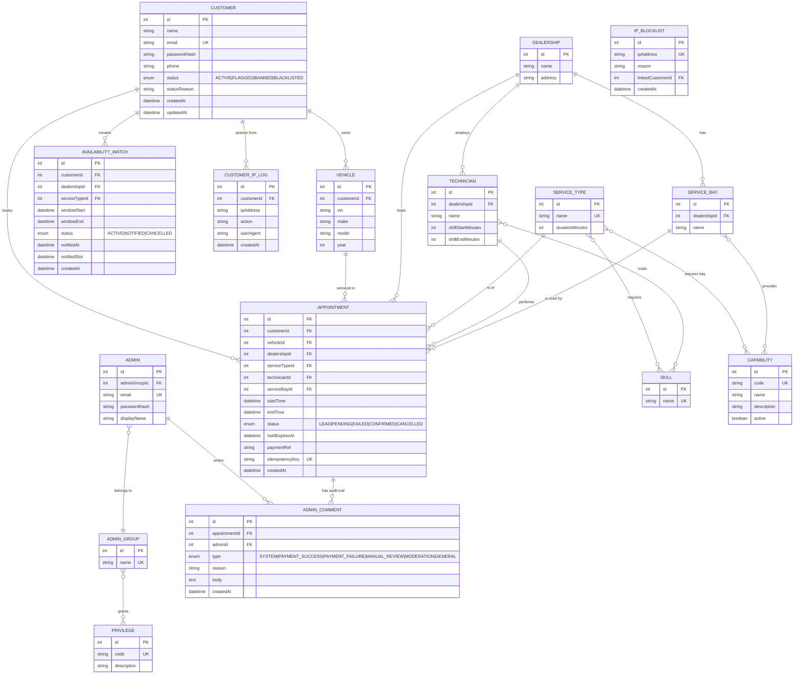
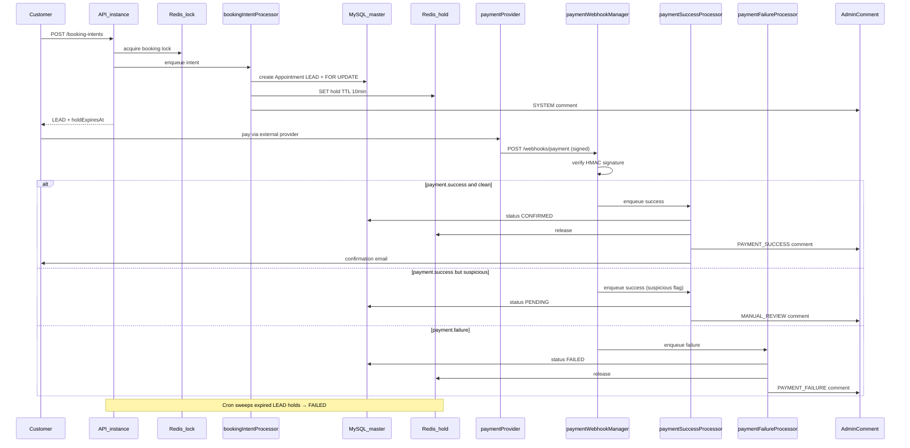

# Future Implementations (Phase 2)

**International scale, multi-instance deployment**

Phase 2 extends the **Phase 1** scheduler for a company operating globally with high traffic,
multiple load-balanced API instances, payment-gated bookings, and abuse controls.

Nothing in this document is implemented yet. It builds on the current Phase 1 model:

- **Customer** — single entity for credentials, profile, vehicles, appointments, and order history (no separate `User` table).
- **Admin** — separate credentials; each admin **belongs to one AdminGroup**.
- **AdminGroup** — holds **Privileges** that gate admin actions.

See [SYSTEM_DESIGN.md](SYSTEM_DESIGN.md) for the implemented Phase 1 architecture and ERD.

---

## 1. Goals

When Phase 1 limits are reached (single instance, immediate confirmation, no payments):

- **Horizontal scaling** — multiple API instances behind a load balancer.
- **Distributed concurrency** — Redis locks layered over DB pessimistic locks.
- **Payment holds** — deposit required before confirming; 10-minute slot hold.
- **Observability** — structured logging, OpenTelemetry tracing, correlation IDs.
- **Read scaling** — MySQL master/replica routing.
- **Abuse prevention** — banned/blacklisted customers, IP tracking and blocklists.
- **Admin audit trail** — comments on every order through the payment lifecycle.

---

## 2. Domain Model (Phase 2 ERD)

Phase 2 **extends** the Phase 1 model. Entities marked **(new)** or **(changed)** below.



### Join tables (unchanged from Phase 1)

| Table | Links |
|-------|-------|
| `service_bay_capabilities` | ServiceBay ↔ Capability |
| `service_type_required_capabilities` | ServiceType ↔ Capability |
| `service_type_required_skills` | ServiceType ↔ Skill |
| `technician_skills` | Technician ↔ Skill |
| `admin_group_privileges` | AdminGroup ↔ Privilege |

### Key schema changes from Phase 1

| Area | Phase 1 | Phase 2 |
|------|---------|---------|
| `Appointment.status` | `CONFIRMED`, `CANCELLED` | `LEAD`, `PENDING`, `FAILED`, `CONFIRMED`, `CANCELLED` |
| Busy-resource filter | `CONFIRMED` only | `LEAD`, `PENDING`, `CONFIRMED` |
| Payment fields on `Appointment` | — | `holdExpiresAt`, `paymentRef`, `idempotencyKey` |
| `Customer.status` | implicit `ACTIVE` only | `ACTIVE`, `FLAGGED`, `BANNED`, `BLACKLISTED` + `statusReason` |
| **New tables** | — | `admin_comments`, `customer_ip_logs`, `ip_blocklist` |
| **New privileges** | — | `MODERATE_CUSTOMERS`, `COMMENT_ORDERS` |
| Auth model | Customer + Admin (separate) | unchanged — still no `User` table |

---

## 3. Payment-Hold Booking Flow



### Appointment status lifecycle

```
LEAD ──(payment success, clean)──► CONFIRMED
LEAD ──(payment success, suspicious)──► PENDING ──(admin review)──► CONFIRMED | FAILED
LEAD ──(payment failure)──► FAILED
LEAD ──(hold expired, 10 min)──► FAILED
CONFIRMED ──(cancel)──► CANCELLED
```

---

## 4. Distributed Concurrency

**Problem:** pessimistic DB locks work within one connection pool but multiple API instances
can still contend heavily and increase deadlock risk.

**Planned approach — layered locking:**

1. **Redis distributed lock** (Redlock-style) keyed by `dealership:serviceType:startTime` to
   serialize booking intents across instances.
2. **DB `FOR UPDATE`** remains the final correctness guard — never remove it.
3. **Idempotency keys** on booking intents and webhook processing to dedupe retries.

Redis hold keys (`hold:{technicianId}:{bayId}:{startIso}`) complement LEAD rows for fast
cross-instance visibility before DB commit propagates.

---

## 5. Caching (SWR)

Phase 1 uses simple read-through TTL caching. Phase 2 adds **stale-while-revalidate**:

- Serve fresh data within `freshTtl`.
- Serve stale data within `freshTtl + staleTtl` while a single background refresh runs.
- Per-key Redis refresh lock (`SET NX`) prevents cache stampede on hot keys (availability
  probes, reference lists).

---

## 6. Observability

| Component | Planned tool |
|-----------|--------------|
| Structured logs | nestjs-pino (JSON per line) |
| Correlation ID | `x-correlation-id` middleware on every request |
| Tracing | OpenTelemetry → OTLP (Jaeger/Tempo in compose) |
| Metrics | Optional Prometheus `/metrics` endpoint |

Env vars: `LOG_LEVEL`, `OTEL_ENABLED`, `OTEL_EXPORTER_OTLP_ENDPOINT`, `OTEL_SERVICE_NAME`.

---

## 7. Database Read Replicas

TypeORM replication config in `data-source-options.ts`:

- **Master:** all writes, transactions, `FOR UPDATE` locks.
- **Replicas:** availability probes, reference reads, list queries (eventually consistent).

Env: `DB_REPLICA_HOSTS=host1,host2` (comma-separated).

---

## 8. Abuse Controls

Abuse tracking applies to **customers** (the booking actors), not a separate user table.

| Feature | Description |
|---------|-------------|
| `Customer.status` | `FLAGGED` (watch), `BANNED` (blocked, reversible), `BLACKLISTED` (permanent + IP block) |
| IP logging | `CustomerIpLog` records IP per customer/action |
| IP blocklist | Auto-populated when a customer is blacklisted; manual admin entries |
| Guards | `AbuseGuard` + `IpTrackingMiddleware` reject banned/blacklisted customers and blocked IPs |
| Admin API | Ban, blacklist, flag, reinstate customers; view IP logs and blocklist |

New privilege: `MODERATE_CUSTOMERS`.

Customer JWT validation (`JwtStrategy`) re-checks `Customer.status` on every request so a
banned customer cannot keep using an old token.

---

## 9. Admin Comments

Every payment lifecycle branch writes an `AdminComment`:

| Type | When |
|------|------|
| `SYSTEM` | LEAD created, hold expiry |
| `PAYMENT_SUCCESS` | Clean payment confirmation |
| `PAYMENT_FAILURE` | Payment failed or hold expired |
| `MANUAL_REVIEW` | Suspicious payment → PENDING |
| `MODERATION` | Admin ban/blacklist actions on a customer |
| `GENERAL` | Manual admin notes |

Surfaced on admin appointment detail endpoints. New privilege: `COMMENT_ORDERS`.

---

## 10. New API Endpoints (planned)

| Method | Path | Description |
|--------|------|-------------|
| `POST` | `/booking-intents` | Enqueue LEAD creation with payment hold (customer JWT) |
| `GET` | `/booking-intents/:jobId` | Poll intent result (customer JWT) |
| `POST` | `/webhooks/payment` | Signed payment provider webhook |
| `GET` | `/admin/appointments/:id/comments` | Order audit trail |
| `POST` | `/admin/appointments/:id/comments` | Add manual comment |
| `POST` | `/admin/customers/:id/ban` | Ban customer |
| `POST` | `/admin/customers/:id/blacklist` | Blacklist customer + block known IPs |
| `POST` | `/admin/customers/:id/flag` | Flag for review |
| `POST` | `/admin/customers/:id/reinstate` | Restore ACTIVE |
| `GET` | `/admin/customers/:id/ip-logs` | IP history for customer |
| `GET` | `/admin/blocklist/ips` | IP blocklist |

---

## 11. Infrastructure Additions

| Service | Purpose |
|---------|---------|
| Jaeger / Tempo | Trace collection (OTLP) |
| MySQL replica(s) | Read scaling |
| Multiple API pods | Load-balanced behind ingress |

Docker Compose would gain a tracing backend; production would use managed MySQL replicas.

---

## 12. Migration Path from Phase 1

1. Add migration expanding `appointments.status` enum and payment columns (`holdExpiresAt`, `paymentRef`, `idempotencyKey`).
2. Add `admin_comments`, `customer_ip_logs`, `ip_blocklist` tables.
3. Add `customers.status` + `customers.statusReason` columns (default existing rows to `ACTIVE`).
4. Deploy Redis lock + hold services alongside existing booking path.
5. Feature-flag `/booking-intents` vs direct `/appointments` booking.
6. Enable read replicas for reference/availability reads only.
7. Roll out observability stack before multi-instance cutover.

**Risk:** changing busy-status filter from `CONFIRMED`-only to include `LEAD`/`PENDING` must
ship atomically with the payment-hold flow to avoid double-booking during holds.

**No User table migration:** Phase 1 never had a `users` table; customer and admin credentials
already live on `customers` and `admins` respectively.

---

## 13. Out of Scope (even in Phase 2)

- Payment provider integration (FE handles checkout; we only receive webhooks).
- Multi-dealership timezone localization.
- Customer-facing UI.
- Multi-resource jobs (multiple technicians per appointment).
- Re-introducing a shared `User` auth table (customer and admin remain separate principals).
