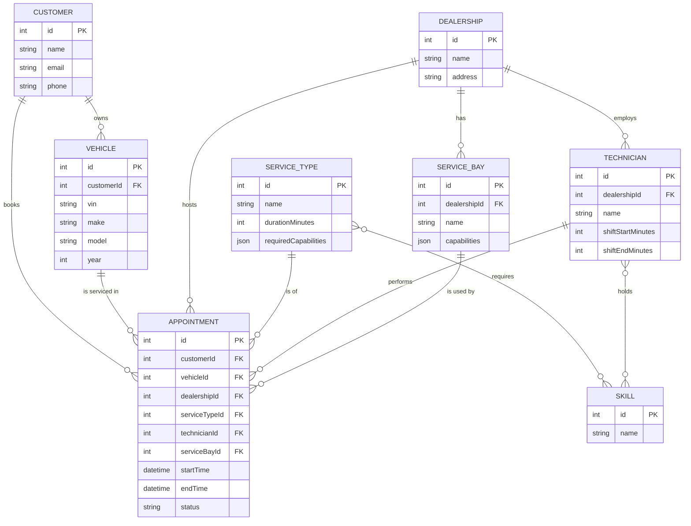
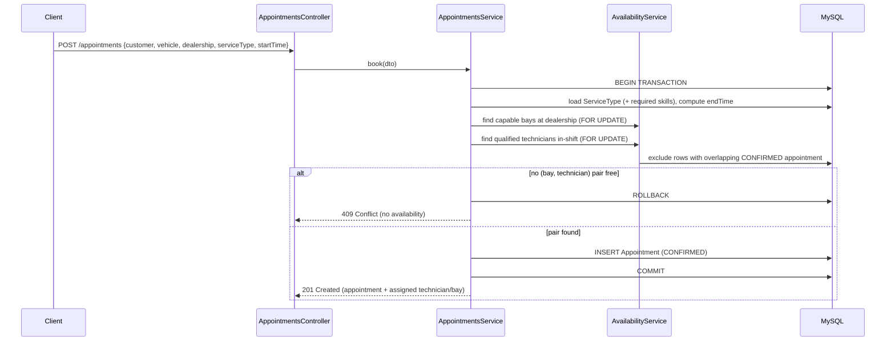

# System Design: Unified Service Scheduler

**Keyloop Technical Assessment - Scenario A (Ownership domain)**

## 1. Context & Goal

Replace manual service-booking systems with an API-driven **Appointment Scheduler**. A
customer requests a service appointment for a specific **vehicle**, **service type**, and
**dealership** at a desired time. The system confirms the booking only when **both** a
capable **Service Bay** and a **qualified Technician** are free for the *entire* service
duration, and then persists a durable **Appointment** record linking customer, vehicle,
technician, and bay.

The three core requirements from the brief:

1. **Resource-Constrained Booking** - request an appointment (vehicle, service type, dealership, desired time).
2. **Real-Time Availability Check** - verify a Service Bay *and* a qualified Technician are both free for the whole duration before confirming.
3. **Confirmed Appointment Record** - on success, persist an appointment associating customer, vehicle, technician, and bay.

## 2. Assumptions (resolving ambiguity)

The brief is intentionally ambiguous. The following reasonable assumptions are made:

| # | Assumption | Rationale |
|---|------------|-----------|
| A1 | One technician **and** one bay per appointment. | Simplest model that satisfies the requirement; multi-resource jobs are future work. |
| A2 | Service duration is **fixed per service type** (e.g. "Oil Change" = 60 min). `endTime = startTime + durationMinutes`. | Deterministic availability math; matches typical menu pricing in automotive retail. |
| A3 | "Qualified" = **skill match**. A `ServiceType` requires a set of `Skill`s; a technician qualifies iff they hold *all* required skills. | Models real technician certifications (e.g. EV-certified, diagnostics). |
| A4 | A bay qualifies via **capabilities** it must possess for the service (e.g. a lift, an alignment rig). | Bays are not interchangeable in real workshops. |
| A5 | Resources are **scoped to a dealership**. Only that dealership's technicians/bays are considered. | A bay/technician physically lives at one site. |
| A6 | All times are stored and compared in **UTC**. | Avoids timezone bugs; presentation layer localizes. |
| A7 | Technicians have **working-hour shifts**; a booking must fit entirely within a shift. | Prevents booking outside staffed hours. Implemented as a simple daily window; can be relaxed to 24/7. |
| A8 | Overlap uses **half-open intervals** `[start, end)`: an appointment ending at 10:00 does **not** conflict with one starting at 10:00. | Standard scheduling convention; avoids off-by-one rejections. |
| A9 | **Out of scope:** authentication/authorization, payments, notifications, customer self-service UI. | Keeps focus on the scheduling core. |
| A10 | Cancelled appointments **free** their resources and are excluded from conflict checks. | Enables rebooking of freed slots. |

## 3. Domain Model

### Entities

- **Customer** - owner of vehicles, requester of appointments.
- **Vehicle** - belongs to a customer (`vin`, `make`, `model`, `year`).
- **Dealership** - physical site owning bays and technicians.
- **ServiceType** - named service with a fixed `durationMinutes`; M:N `requiredSkills`; `requiredCapabilities` (string list) for bays.
- **Skill** - a competency; M:N to both `ServiceType` (required) and `Technician` (held).
- **ServiceBay** - belongs to a dealership; has `capabilities` (string list).
- **Technician** - belongs to a dealership; holds skills; has a daily shift window (`shiftStartMinutes`..`shiftEndMinutes`, minutes-from-midnight UTC).
- **Appointment** - the confirmed record; links all parties; has `startTime`, `endTime`, `status` (`CONFIRMED` | `CANCELLED`).

## 4. Booking Flow

### Algorithm

1. Validate the request DTO (`class-validator`).
2. Resolve and validate referenced entities (customer, vehicle belongs to customer, dealership, service type). Compute `endTime = startTime + durationMinutes`.
3. Open a DB **transaction**.
4. **Bays:** select bays at the dealership whose `capabilities` cover the service's `requiredCapabilities`, with **no overlapping `CONFIRMED` appointment** in `[start, end)`. Lock candidate rows (`FOR UPDATE`).
5. **Technicians:** select technicians at the dealership holding **all** required skills, whose shift fully contains `[start, end)`, with **no overlapping `CONFIRMED` appointment**. Lock candidate rows.
6. If either set is empty -> **rollback**, return `409`.
7. Pick the first available `(technician, bay)` pair, **INSERT** the appointment, **commit**.

## 5. Concurrency & "Real-Time" Correctness

The risk: two concurrent requests both observe the same bay/technician as free and double-book it.

**Chosen approach - pessimistic locking inside a transaction:**

- The booking runs in a single transaction at **READ COMMITTED** isolation. Candidate technician and bay rows are read with a **pessimistic write lock** (`SELECT ... FOR UPDATE` via TypeORM `setLock('pessimistic_write')`), in a fixed id order (bays then technicians) to avoid deadlocks.
- A second concurrent transaction targeting the same resource **blocks** on the row lock until the first commits/rolls back, then re-evaluates availability and correctly sees the new appointment - so it fails over to another resource or returns `409`.
- **Why READ COMMITTED:** under MySQL's default REPEATABLE READ, non-locking `SELECT`s read the snapshot taken at the transaction's first read, so the blocked transaction would *not* see the appointment the winner just committed, defeating the lock. READ COMMITTED makes each statement read the latest committed data.

**Alternatives considered:**

- *Optimistic locking (version column):* lower contention, but the conflicting unit here is the *appointment interval*, not a single row's version - harder to express and would surface as retry storms under load.
- *Unique DB constraint:* SQL cannot natively enforce "no overlapping interval per resource" (no exclusion constraints in MySQL like Postgres `EXCLUDE`). A `(resourceId, startTime)` unique key only catches identical start times, not partial overlaps.
- *Application-level distributed lock (e.g. Redis):* needed if scaling to multiple instances with high contention; noted as future work. For a single MySQL-backed service, row locks are simpler and correct.

Pessimistic row locks give correctness with minimal complexity at the expected scale of a dealership scheduler.

## 6. API Surface

| Method | Path | Purpose |
|--------|------|---------|
| `POST` | `/appointments` | Book an appointment. `201` with assigned technician+bay, or `409` if none available. |
| `GET` | `/appointments/:id` | Fetch an appointment. |
| `GET` | `/appointments` | List/filter (by dealership, date). |
| `POST` | `/appointments/:id/cancel` | Cancel; frees resources. |
| `GET` | `/availability` | Open slots for a service/dealership/date. |
| `GET` | `/dealerships`, `/service-types`, ... | Read reference data (supporting endpoints). |

Validation via `class-validator` DTOs; a global exception filter normalizes error responses (`409` for no-availability, `404` for missing references, `400` for bad input).

## 7. Tech Stack

- **NestJS** (modular structure, DI, testability).
- **TypeORM** with **MySQL 8** (real transactions + `FOR UPDATE` locking).
- **class-validator / class-transformer** for DTO validation.
- **Jest** for unit + integration tests.
- **Docker Compose** for a local MySQL instance.
- A **seed script** populating dealerships, skills, service types, bays, technicians, customers, vehicles.

## 8. Testing Strategy

- **Unit:** `AvailabilityService` interval-overlap and qualification logic (skills, capabilities, shift containment), with mocked repositories.
- **Integration:** booking happy path (`201`), no-capacity (`409`), cancellation frees a slot, and a **concurrent double-booking** test issuing two simultaneous bookings for the only free resource and asserting exactly one succeeds.

## 9. Future Work

- Cleanup/buffer time between appointments per bay.
- Multi-resource jobs (more than one technician/bay).
- Per-dealership operating hours and holidays; technician day-off calendars.
- Reschedule endpoint; waitlist when fully booked.
- Distributed locking (Redis) and horizontal scaling.
- AuthN/AuthZ, notifications, payments.
