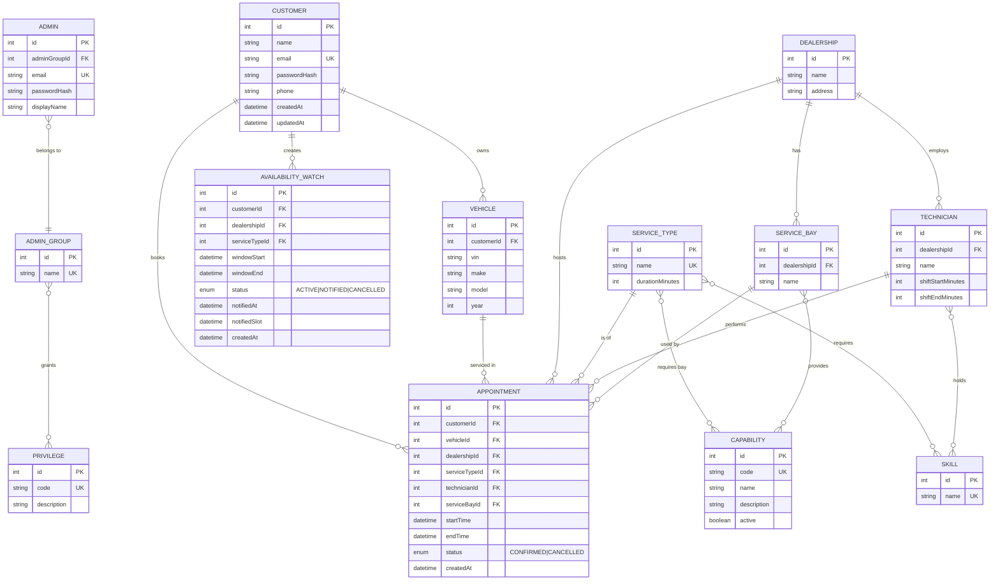
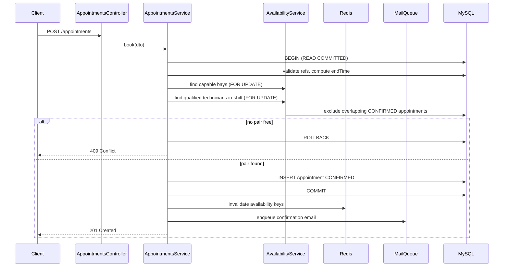
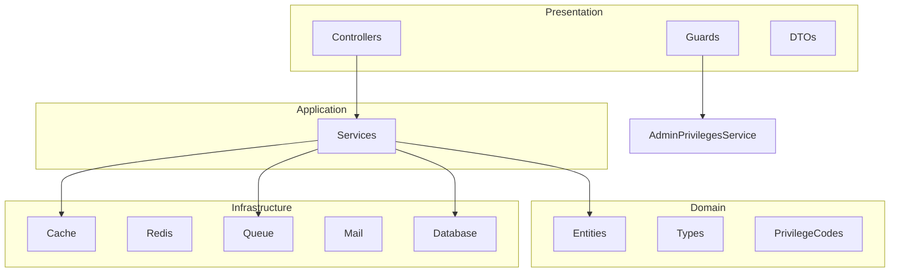

# System Design: Unified Service Scheduler (Phase 1)

**Keyloop Technical Assessment — Scenario A (Ownership domain)**

Phase 1 delivers a **production-ready small-scale** appointment scheduler: a single-instance
NestJS API backed by MySQL, with normalized capabilities, JWT auth, admin RBAC, Redis caching,
BullMQ background jobs, advance booking, availability watches, and email notifications.

For international-scale features (distributed locking, payments, abuse controls, read replicas,
etc.) see [FUTURE_IMPLEMENTATIONS.md](FUTURE_IMPLEMENTATIONS.md).

---

## 1. Context & Goal

Replace manual service-booking with an API-driven **Appointment Scheduler**. A customer requests
a service appointment for a specific **vehicle**, **service type**, and **dealership** at a
desired time. The system confirms the booking only when **both** a capable **Service Bay** and
a **qualified Technician** are free for the *entire* service duration, then persists a durable
**Appointment** record.

Core requirements:

1. **Resource-constrained booking** — vehicle, service type, dealership, desired time.
2. **Real-time availability check** — bay *and* qualified technician free for the full duration.
3. **Confirmed appointment record** — links customer, vehicle, technician, and bay.

Phase 1 additions for a small service company:

- Normalized **capabilities** (no free-form strings).
- **Customer accounts** with order history.
- **Admin RBAC** via groups and privileges.
- **Redis caching** for hot reads.
- **Advance booking** (slot discovery, future validation, reschedule).
- **Availability watches** with email when a slot opens.
- **Health checks** and migration support.

---

## 2. Assumptions

| # | Assumption | Rationale |
|---|------------|-----------|
| A1 | One technician **and** one bay per appointment. | Simplest model; multi-resource jobs are future work. |
| A2 | Service duration is **fixed per service type**. `endTime = startTime + durationMinutes`. | Deterministic availability math. |
| A3 | "Qualified" = **skill match**. Technician must hold *all* required skills. | Models certifications (EV, diagnostics). |
| A4 | Bay qualifies via **normalized capabilities** (M:N join table). | Consistent values; no typos in string arrays. |
| A5 | Resources are **scoped to a dealership**. | Bays/technicians live at one site. |
| A6 | All times stored and compared in **UTC**. | Avoids timezone bugs. |
| A7 | Technicians have **daily shift windows**; booking must fit entirely within shift. | Prevents off-hours bookings. |
| A8 | Overlap uses **half-open intervals** `[start, end)`. | Back-to-back slots allowed. |
| A9 | Cancelled appointments **free** resources and are excluded from conflict checks. | Enables rebooking. |
| A10 | Bookings require a **future** `startTime`. | Advance-booking guard. |
| A11 | Single API instance + single MySQL primary. | Phase 1 scale; horizontal scaling is Phase 2. |

---

## 3. Domain Model (ERD)



### Join tables (not shown as entities)

| Table | Links |
|-------|-------|
| `service_bay_capabilities` | ServiceBay ↔ Capability |
| `service_type_required_capabilities` | ServiceType ↔ Capability |
| `service_type_required_skills` | ServiceType ↔ Skill |
| `technician_skills` | Technician ↔ Skill |
| `admin_group_privileges` | AdminGroup ↔ Privilege |

### Entity summary

- **Customer** — credentials + profile; owns vehicles, appointments, and order history.
- **Admin** — separate credentials; belongs to one **AdminGroup** whose privileges control admin actions.
- **AdminGroup** — named bundle of **Privilege** rows (e.g. SUPER_ADMIN).
- **Capability** — normalized bay equipment (LIFT, EV_CHARGER, …).
- **ServiceBay / ServiceType** — M:N to Capability (provides / requires).
- **Appointment** — `CONFIRMED` or `CANCELLED`; only CONFIRMED blocks resources.
- **AvailabilityWatch** — customer watches a time window; emailed when a slot opens.

---

## 4. Booking Flow



### Algorithm

1. Validate DTO (`class-validator`); reject past `startTime`.
2. Resolve customer, vehicle (must belong to customer), dealership, service type.
3. Compute `endTime = startTime + durationMinutes`.
4. Transaction at **READ COMMITTED**:
   - Lock capable bays (`FOR UPDATE`, id order).
   - Lock qualified on-shift technicians (`FOR UPDATE`, id order).
   - Exclude resources with overlapping **CONFIRMED** appointments in `[start, end)`.
5. If either set empty → rollback, **409**.
6. Insert appointment as **CONFIRMED**, commit.
7. Invalidate availability cache; enqueue confirmation email (best-effort, non-blocking).

---

## 5. Concurrency & Correctness

**Risk:** two concurrent requests both see the same bay/technician as free and double-book.

**Approach — pessimistic row locking inside a transaction:**

- Booking runs in one transaction at **READ COMMITTED**.
- Candidate bay and technician rows are locked with **`SELECT … FOR UPDATE`** in fixed order (bays then technicians) to avoid deadlocks.
- A competing transaction **blocks** on the row lock, then re-reads committed data and correctly sees the winner's appointment.
- **Why READ COMMITTED:** under MySQL REPEATABLE READ, non-locking reads use the transaction-start snapshot and would *not* see the winner's commit, defeating the lock.

This is sufficient for Phase 1 (single instance). Multi-instance distributed locking is deferred to Phase 2 — see [FUTURE_IMPLEMENTATIONS.md](FUTURE_IMPLEMENTATIONS.md).

---

## 6. Caching

Redis backs a thin JSON cache with graceful degradation (cache miss → DB, cache failure → DB).

| Namespace | TTL | Invalidated on |
|-----------|-----|----------------|
| `ref:*` (dealerships, service-types, capabilities, bays, technicians) | 300s | Admin writes |
| `availability:*` (probes, slot lists) | 15s | Booking, cancel, reschedule |
| `privileges:{adminId}` | 60s | Admin group changes (manual TTL expiry) |

---

## 7. Background Jobs (BullMQ)

| Queue | Purpose |
|-------|---------|
| `mail` | Booking confirmation, cancellation, watch-available emails (nodemailer → Mailpit locally) |
| `availability-watch` | Re-check watches on slot-freed events; cron sweep for active watches |

Watch flow: on cancel/reschedule → enqueue targeted re-check → if open slot in watch window → email user → mark watch NOTIFIED.

---

## 8. Auth & RBAC

- **Customers:** register/login via `POST /auth/register` and `POST /auth/login` → JWT with `kind=CUSTOMER`. Order history via `GET /me/appointments` or `GET /appointments` (same data for customers).
- **Admins:** login via `POST /auth/admin/login` → JWT with `kind=ADMIN`. Each admin belongs to one **AdminGroup**; that group's privileges determine allowed actions.
- **Privileges** (canonical codes in `src/domain/rbac/privilege-codes.ts`):
  - `VIEW_APPOINTMENTS` — list all appointments (admin).
  - `MANAGE_CAPABILITIES`, `MANAGE_BAYS`, `MANAGE_TECHNICIANS`, `MANAGE_DEALERSHIPS`, `MANAGE_SERVICE_TYPES`, `MANAGE_SKILLS` — resource CRUD.
  - `MANAGE_ADMINS` — admin accounts, groups, and privilege rows.
- **Guards:** `JwtAuthGuard` validates bearer tokens; `CustomerAuthGuard` / `AdminAuthGuard` enforce principal kind (admins bypass `CustomerAuthGuard` where handlers grant broader access); `PrivilegesGuard` + `@RequirePrivileges()` on admin mutations. No `/admin` URL prefix.

---

## 9. API Surface

### Pagination

List endpoints accept optional query `page` (default `1`) and `limit` (default `20`, max `100`). Response shape:

```json
{ "data": [], "total": 0, "page": 1, "limit": 20, "totalPages": 0 }
```

Applies to public reference lists and admin list endpoints that use `PaginationQueryDto`.

### Auth

| Method | Path | Auth | Description |
|--------|------|------|-------------|
| `POST` | `/auth/register` | — | Create customer account. |
| `POST` | `/auth/login` | — | Customer login → JWT (`kind=CUSTOMER`). |
| `POST` | `/auth/admin/login` | — | Admin login → JWT (`kind=ADMIN`). |
| `GET` | `/auth/me` | JWT | Current principal. |

### Appointments & availability

| Method | Path | Auth | Description |
|--------|------|------|-------------|
| `POST` | `/appointments` | — | Book (future time only). `201` or `409`. |
| `GET` | `/appointments` | JWT (customer or admin) | Customer: own appointments (newest first). Admin: all appointments if `VIEW_APPOINTMENTS`, else `403`. |
| `GET` | `/appointments/:id` | JWT (customer or admin) | Customer: own only (`404` otherwise). Admin: any. |
| `GET` | `/me/appointments` | JWT (customer) | Same as customer `GET /appointments`. |
| `POST` | `/appointments/:id/cancel` | JWT (customer or admin) | Customer: own only. Admin: any. Frees resources, notifies watchers. |
| `POST` | `/appointments/:id/reschedule` | JWT (customer or admin) | Customer: own only. Admin: any. Atomic move; `409` if no availability. |
| `GET` | `/availability` | — | Probe one start time (cached). |
| `GET` | `/availability/slots` | — | Open slots for a UTC day (cached). |
| `POST` | `/availability/watches` | JWT (customer) | Create watch. |
| `GET` | `/availability/watches` | JWT (customer) | List your watches. |
| `POST` | `/availability/watches/:id/cancel` | JWT (customer) | Cancel watch. |

### Reference data (public read)

All `GET` below are **public** (no bearer token). Optional `?page=&limit=` on list routes. `GET :id` is public for single-resource reads.

| Method | Path | Description |
|--------|------|-------------|
| `GET` | `/dealerships`, `/dealerships/:id` | Dealerships (paginated list). |
| `GET` | `/service-types`, `/service-types/:id` | Service types. |
| `GET` | `/capabilities`, `/capabilities/:id` | Bay capabilities. |
| `GET` | `/skills`, `/skills/:id` | Technician skills. |
| `GET` | `/customers` | Customers with vehicles (paginated). |
| `GET` | `/customers/:id/vehicles` | Vehicles for a customer (paginated). |
| `GET` | `/service-bays`, `/service-bays/:id` | All bays; optional `?dealershipId=`. |
| `GET` | `/technicians`, `/technicians/:id` | All technicians; optional `?dealershipId=`. |
| `GET` | `/dealerships/:id/service-bays` | Bays at a dealership (paginated). |
| `GET` | `/dealerships/:id/technicians` | Technicians at a dealership (paginated). |
| `GET` | `/health` | DB + Redis probe. |

### Management (admin JWT + privilege)

**POST**, **PATCH**, and **DELETE** require admin bearer token and the privilege in the table. Routes are not prefixed with `/admin`.

| Resource | Privilege | Mutations |
|----------|-----------|-----------|
| Capabilities | `MANAGE_CAPABILITIES` | `POST/PATCH/DELETE /capabilities` |
| Skills | `MANAGE_SKILLS` | `POST/PATCH/DELETE /skills` |
| Dealerships | `MANAGE_DEALERSHIPS` | `POST/PATCH/DELETE /dealerships` |
| Service types | `MANAGE_SERVICE_TYPES` | `POST/PATCH/DELETE /service-types` |
| Service bays | `MANAGE_BAYS` | `POST /dealerships/:id/service-bays`, `PATCH/DELETE /service-bays/:id` |
| Technicians | `MANAGE_TECHNICIANS` | `POST /dealerships/:id/technicians`, `PATCH/DELETE /technicians/:id` |
| Admins | `MANAGE_ADMINS` | CRUD `/admins`, `/admin-groups`; `GET/POST/DELETE /privileges` (no PATCH — codes are stable identifiers) |

---

## 10. Tech Stack

| Layer | Choice |
|-------|--------|
| API | NestJS 10, class-validator |
| ORM / DB | TypeORM, MySQL 8 |
| Cache / queues | Redis 7, BullMQ, ioredis |
| Auth | JWT, argon2, passport-jwt |
| Email | nodemailer → Mailpit (local) |
| Tests | Jest (unit + e2e) |
| Infra | Docker Compose (MySQL, phpMyAdmin, Redis, Mailpit) |

---

## 11. Code Structure (Clean Architecture)

The codebase follows a **layered clean architecture**: domain at the centre, application use
cases per feature, infrastructure adapters on the outside, and HTTP presentation at the edge.
NestJS modules under `src/modules/` are thin **composition roots** that wire layers together.

### Directory layout

```
src/
├── domain/                         # Core business model (no HTTP, no infra)
│   ├── entities/                   # TypeORM entities (persistence annotations)
│   ├── auth/jwt-payload.interface.ts
│   └── rbac/privilege-codes.ts
│
├── infrastructure/                 # External concerns / adapters
│   ├── cache/                      # Redis cache service + invalidation helpers
│   ├── redis/                      # ioredis client (global)
│   ├── queue/                      # BullMQ root + queue constants (global)
│   ├── notifications/              # Mail + watch processors, scheduler
│   ├── rbac/                       # RbacModule — PrivilegesGuard ↔ AdminPrivilegesModule
│   └── database/                   # seed.ts, data-source.ts (CLI / migrations)
│
├── shared/presentation/            # Cross-cutting HTTP / auth plumbing
│   ├── guards/                     # JwtAuthGuard, CustomerAuthGuard, AdminAuthGuard, PrivilegesGuard
│   ├── decorators/                 # @CurrentUser(), @RequirePrivileges()
│   ├── dto/                        # pagination-query.dto.ts
│   ├── filters/                    # AllExceptionsFilter
│   └── strategies/                 # JWT Passport strategy
│
├── modules/                        # Feature modules (use cases + HTTP)
│   ├── auth/
│   │   ├── application/            # auth.service.ts
│   │   ├── presentation/           # auth.controller.ts, dto/
│   │   └── auth.module.ts
│   ├── appointments/
│   ├── customers/
│   ├── capabilities/
│   ├── skills/
│   ├── dealerships/
│   ├── service-bays/
│   ├── technicians/
│   ├── service-types/
│   ├── admins/
│   ├── admin-groups/
│   ├── admin-privileges/
│   └── health/
│
├── config/                         # data-source-options.ts (shared by Nest + CLI)
├── app.module.ts                   # Root composition
├── main.ts
└── swagger.ts
```

Each feature module (except `health`) follows the same internal shape:

```
modules/{feature}/
├── application/          # *.service.ts — use cases, orchestration, transactions
├── presentation/         # *.controller.ts, dto/ — HTTP input/output
└── {feature}.module.ts   # NestJS wiring (TypeORM repos, imports, exports)
```

### Layer responsibilities

| Layer | Location | Responsibility |
|-------|----------|----------------|
| **Domain** | `src/domain/` | Entities, shared types (`JwtPayload`, `AuthKind`), privilege code constants. No NestJS controllers, no Redis/queue code. |
| **Application** | `src/modules/*/application/` | Business workflows: booking, availability math, admin CRUD, auth login/register. Services inject TypeORM repositories and infrastructure services. |
| **Infrastructure** | `src/infrastructure/` | Technical adapters: Redis cache, BullMQ queues, nodemailer mail, DB seed/CLI. Global modules (`AppCacheModule`, `RedisModule`, `QueueModule`) are registered once in `AppModule`. |
| **Presentation** | `src/modules/*/presentation/` + `src/shared/presentation/` | HTTP controllers, request DTOs (`class-validator`), guards, filters. Controllers delegate to application services only. |
| **Composition** | `src/modules/*/*.module.ts`, `src/app.module.ts` | Declares imports/exports, registers controllers and providers, connects layers without containing business logic. |

### Dependency direction

Dependencies point **inward**:



- **Presentation** may call **application** services and use **shared** guards/decorators.
- **Application** services depend on **domain** entities and **infrastructure** ports (cache, queues).
- **Domain** does not depend on any outer layer.
- **Infrastructure** implements persistence and messaging; it does not contain booking rules.

### Module map (bounded contexts)

| Module | Application services | Routes |
|--------|---------------------|--------|
| `auth` | `AuthService` | `/auth/*` |
| `appointments` | `AppointmentsService`, `AvailabilityService`, `AvailabilityWatchService` | `/appointments/*`, `/availability/*`, `/me/appointments` |
| `customers` | `CustomersService` | `GET /customers`, `GET /customers/:id/vehicles` (public, paginated) |
| `capabilities`, `skills`, `dealerships`, `service-types`, `service-bays`, `technicians` | One `*.service.ts` each | Public paginated `GET` + `GET :id`; admin `POST/PATCH/DELETE` (guarded) |
| `admins`, `admin-groups`, `admin-privileges` | Admin / group / privilege services | `/admins`, `/admin-groups`, `/privileges` (admin only) |
| `health` | — | `/health` |

Cross-module imports are explicit in each `*.module.ts` (e.g. `ServiceBaysModule` imports
`CapabilitiesModule` and `DealershipsModule` because bays require capability and dealership
validation). Feature modules that need RBAC import `RbacModule` from `infrastructure/rbac/`.

### RBAC wiring note

`AdminPrivilegesService` lives in `modules/admin-privileges/application/` and resolves an
admin's effective privileges (cached in Redis). `PrivilegesGuard` in `shared/presentation/guards/`
calls that service. `RbacModule` (`infrastructure/rbac/rbac.module.ts`) and `AdminPrivilegesModule`
use NestJS `forwardRef` to avoid a circular module dependency (guard needs the service; the
privileges controller needs the guard).

### Possible next step

Repository **ports** (interfaces in domain/application) with TypeORM **adapters** in
infrastructure would further decouple application services from `@InjectRepository`. That is
not implemented in Phase 1; services inject TypeORM repositories directly for simplicity.

---

## 12. Testing Strategy

- **Unit:** `AvailabilityService` — overlap, capability/skill matching, shift containment, slot enumeration.
- **E2e (MySQL + Redis):** booking `201`, overlap `409`, back-to-back allowed, cancel frees slot, concurrent double-booking (exactly one wins).

---

## 13. Local Development Infrastructure (Docker Compose)

Start all services with `docker compose up -d` from the project root.

| Service | URL / port | Purpose |
|---------|------------|---------|
| MySQL | `localhost:3306` | Primary database for the API |
| phpMyAdmin | http://localhost:8080 | Web UI to browse and query MySQL |
| Redis | `localhost:6379` | Cache + BullMQ |
| Mailpit | http://localhost:8025 (UI), `localhost:1025` (SMTP) | Local email sink |

### phpMyAdmin access

phpMyAdmin is pre-configured to connect to the `mysql` service. After `docker compose up -d`,
open **http://localhost:8080**.

| Field | Value |
|-------|-------|
| **Web UI** | http://localhost:8080 |
| **Server** | `mysql` (set automatically; do not change unless connecting from outside Docker) |
| **Application user** | `scheduler` |
| **Application password** | `schedulerpass` |
| **Database** | `scheduler` |

**Root access** (full server admin — use only for troubleshooting):

| Field | Value |
|-------|-------|
| **Username** | `root` |
| **Password** | `rootpass` |

These credentials match `docker-compose.yml` and [`.env.example`](.env.example) (`DB_*` variables).
The NestJS app uses the **application user** (`scheduler` / `schedulerpass` / database `scheduler`).

---

## 14. Deployment Notes

- Dev: `DB_SYNCHRONIZE=true` auto-creates schema.
- Prod: `DB_SYNCHRONIZE=false`, run TypeORM migrations (`npm run migration:run`).
- Seed: `npm run seed` populates demo dealership, capabilities, users, admin (`src/infrastructure/database/seed.ts`).
- **Production:** do not expose phpMyAdmin publicly; use a VPN, SSH tunnel, or a managed DB console instead.
